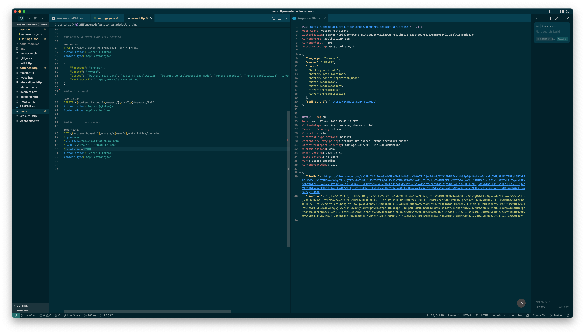

# Enode API Demos for VSCode

This repository contains configuration and .http files to interact with the Enode API for demo and testing purposes using the VSCode [Rest Client](https://github.com/Huachao/vscode-restclient) extension. It's great for quick API explorations and technical demos.

The screenshot below shows how to request a new link sesson from the `users` endpoint:




## Prerequisites
- [Visual Studio Code](https://code.visualstudio.com/)
- [Rest Client Extension](https://github.com/Huachao/vscode-restclient)

## Setup
1. Clone this repository to your local machine
2. Install the [Rest Client](https://github.com/Huachao/vscode-restclient) Extension in VSCode
3. Create a `.env` file in the root directory with the following environment variables:

```bash
# URLs for production, don't change
BASE_URL=https://enode-api.production.enode.io
AUTH_URL=https://oauth.production.enode.io/oauth2/token

# URLs for dev, don't change
BASE_DEV_URL=https://enode-api.dev.enode.io
AUTH_DEV_URL=https://oauth.dev.enode.io/oauth2/token

# URLs for sandbox, don't change
BASE_SANDBOX_URL=https://enode-api.dev.enode.io
AUTH_SANDBOX_URL=https://oauth.dev.enode.io/oauth2/token

# Credentials fo your clients. Each client needs `clientId` and `secret`.
CLIENT_PROD_ID={YOURSECRET}
CLIENT_PROD_SECRET={YOURSECRET}

# Another client
CLIENT_SANDBOX_ID={YOURSECRET}
CLIENT_SANDBOX_SECRET={YOURSECRET}
```

Lastly, open .vscode/settings.json and updated the default enode user name

```json
"$shared": {
    "userId": "frederik",
    "token": "token"
},
```

## Usage

### Get a valid access token
Before sending requests to Enode API, get an access token via OAuth. Open auth.http and click on `Send Request`. A new response window should open showing the response of the request:

```http
POST https://oauth.production.enode.io/oauth2/token HTTP/1.1
User-Agent: vscode-restclient
Content-Type: application/x-www-form-urlencoded
content-length: 29
accept-encoding: gzip, deflate, br

grant_type=client_credentials


HTTP/1.1 200 OK
Date: Mon, 07 Apr 2025 13:29:32 GMT
Content-Type: application/json;charset=UTF-8
Content-Length: 157
Connection: close
Cache-Control: no-store
Pragma: no-cache

{
  "access_token": "your token",
  "expires_in": 3599,
  "scope": "",
  "token_type": "bearer"
}
```
Copy the token and paste it into .vscode/settings.json under `token`:

```json
"$shared": {
    "userId": "frederik",
    "token": "token"
},
```

> [!IMPORTANT]
> Tokens expire after 3600s / 1h - make sure to repeat the token step if the token has expired.

### Query the API

Now its time to query the API. The repository contains `.http` files which define API routes per entity. Those routes can be send through a click on `Send Request`.


